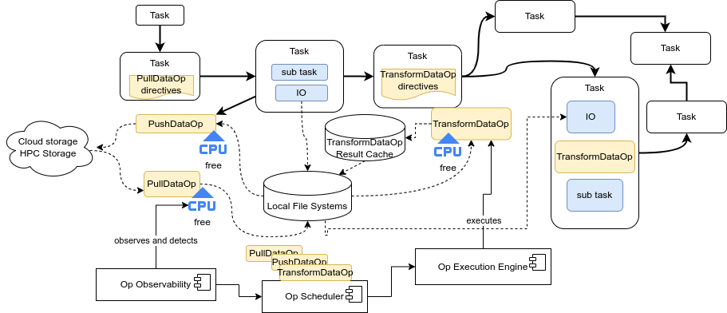

# ODOP - Opportunistic Data Operations Platform

## Overview

ODOP is a framework supporting the developer/scientist to explore free resources allocated for their long running applications to carry out data operations in an opportunistic manner. The key idea is that applications can be annotated with functions for data operations, such as moving files, lightweight data analysis and ML, to be executed when resources are free during the run of the main applications. Usually these operations must be done after the long-running application finished.



The following publication provides a high overview of ODOP:
>Minh-Tri Nguyen, Anh-Dung Nguyen, Jarno Rantaharju, Touko Puro, Matthias Rheinhardt, Maarit Korpi-Lagg, Hong-Linh Truong, **"Supporting Opportunistic Data Operations for Data-Intensive Computational Applications** ([download PDF](https://acris.aalto.fi/ws/portalfiles/portal/165401785/BDOP_CameraReady.pdf)), 2024 IEEE International Conference on Big Data (BigData), Washington, DC, USA, 2024, pp. 3735-3744, doi: 10.1109/BigData62323.2024.10826079. 


Currently ODOP is mainly tested with applications executed atop LUMI. 

## ODOP Architecture

- OpObservability
- OpSchedule
- OpEngine

## API documentation

https://rdsea.github.io/odop

## Quickstart

1. Clone this repo and install the Odop package:

   ```bash
   cd odop
   pip install .
   ```

2. Annotate which function that you want to run opportunistically in the source code. The simplest task only needs name and trigger. We support many other parameter that can help with the scheduling and execution which can be found in the [docs](https://rdsea.github.io/odop)
      ```Python
      import odop

      @odop.task(
            name="optask_name",
            trigger="file_updated",
            file_path="data/file_updated",
      )
      def function():
         # your function implementation
      ```

3. Start Odop in your main function. Here we assume the all source code is under the same directory and odop will automatically scan the optask and run it opportunistically in concurrent with the main function.

   ```Python
   import odop

   if __name__=="__main__":
      odop.start(run_name="run_1")
      #Your main function here
      ...
      odop.stop()
   ```

## Options

1. Odop path

- Odop stores task information, and observability data in the Odop path. The default Odop path is `$HOME/.odop`. This can be set using the `ODOP_PATH`
  variable.
  ```bash
  export ODOP_PATH=$HOME/odop/odop/odop_obs/
  ```

2. The search path for opportunistic tasks can be given as a parameter if the opportunistica task is not in the same directory as the main function

   ```Python
   odop.start(run_name="run_1", task_folder="./local_task_folder")
   ```

3. The path to the configuration file can be provided directly as a
   parameter to `odop.start`.

   ```Python
   odop.start(run_name="run_1", config_file="odop_conf.yaml")
   ```

4. It is possible to monitor the application without starting all the
   components of odop. This does not scan for opportunities and only
   monitors the application

   ```Python
   from odop.odop_obs import OdopObs
   from odop.common import ODOP_PATH

   odop_obs = OdopObs(config_path=ODOP_PATH + "config/odop_conf.yaml")
   odop_obs.start()

   #Your computation here
   ...

   odop_obs.stop()
   ```

## Examples

Further examples can be found in the `examples` folder.
`examples/run_odop.py` contains another example of running odop with while
simulating an HPC workload. `examples/run_monitoring.py` shows how to run
the only the monitoring module.

## Building the Documentation

1. Requirement:

- Python > 3.6
- sphinx
- sphinx_rtd_theme
- myst_parser

```bash
pip install -e ".[docs]"
```

2. Make document

```bash
cd $ODOP_PATH/docs
make html
```

3. Start document server

```bash
cd _build/html
python -m http.server
```

## Testing

- The examples in the `examples` folder can be run as integration tests.

- Running unit tests requires installing additional dependencies:

  ```bash
  pip install ".[dev]"
  ```

  To run the tests use

  ```bash
  pytest
  ```

## Acknowledgment

This work has received funding from the European HighPerformance Computing Joint Undertaking (JU) under grant
agreement No 101118139. W