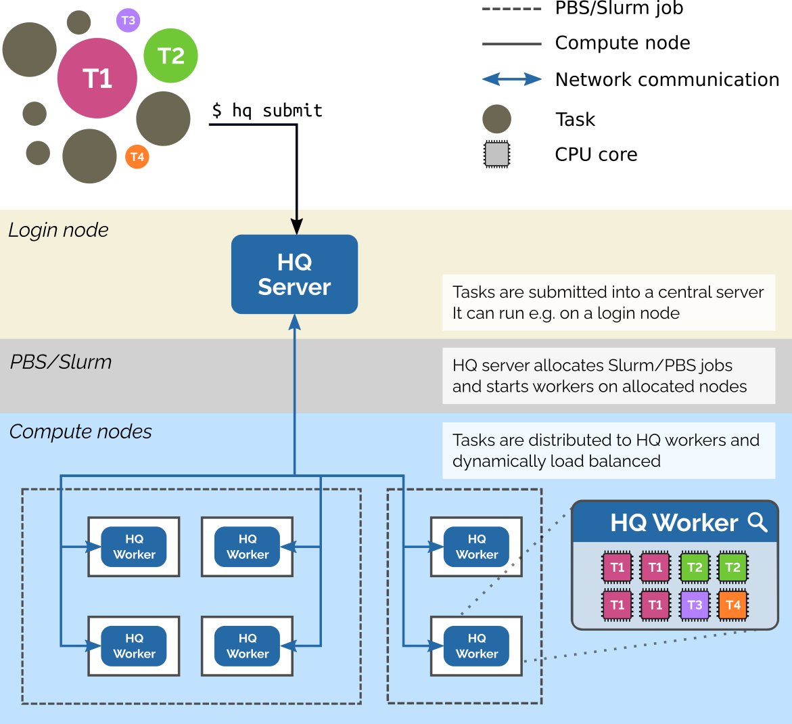

# [HyperQueue](https://lumi-supercomputer.github.io/LUMI-EasyBuild-docs/h/HyperQueue/#license-information)

1.  Architecure

2. How it can help:

- Allocating a HQ worker to each node and this worker will work as our probe, data can be streamed back to the HQ Server
- Using python API of HyperQueue, it can act as CSC monitoring service

3. Questions:

- HQ worker requires allocated resources like other Slurm jobs, it must use at least 1 cpu core which is too much for our job
- If we stream the metric from the HQ worker back to the login node, what is the latency?
- Can we allocate HQ worker to specific node?

# [Slurm](https://slurm.schedmd.com/)

1. Slurm command provides relevant information for monitoring by using sinfo:

- number of CPUs by state (allocatred/idle/other/total)
- the total memory, in MB, currently free on the node
- amount of allocated memory on a node
- CPU load of a node
- Generic resources (gres) associated/currently in use on the nodes.
