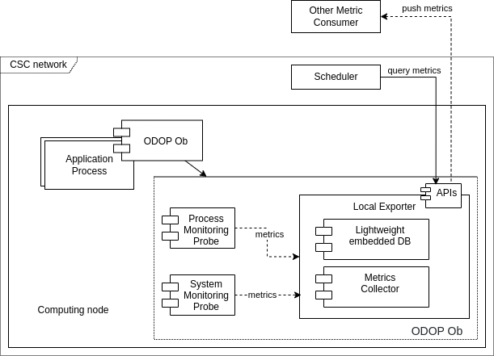

# Monitoring Specification
## 1. System Monitoring
### Metric:
- CPU: Usage/core 
    - Example: A computing node has 128 cores, the monitoring probes should return a dictionary as the following:
    ```json
    {
        "metadata":{
            "frequency": {
                "value": 5,
                "unit": "GHz"
            },
            "thread": 4
        }, 
        "usage":{
            "value": {"core_1": 10, "core_2": 20,..., "core_128":90},
            "unit": "percentage"
        }
    }
    ```

- GPU: Usage/device
    - Example: A computing node has 2 GPU device, the monitoring probes should return a dictionary as the following:
    ```json
    {
        "metadata":{
            "device_1": {
                "frequency": {
                    "value": 1582,
                    "unit": "MHz"
                },
                "core": 3584,
                "mem": {
                    "capacity": 8,
                    "unit": "Gb"
                }
            }, ...
        }, 
        "usage":{
            "device_1": {
                "core": {
                    "value": 50,
                    "unit": "percentage"
                },
                "mem":{
                    "value": 2096,
                    "unit": "Mb"
                }
            }, ...
        }
    }
    ```
- Memory: Usage 
    - Example: The monitoring probes should return a dictionary as the following:
    ```json
    {
        "metadata":{
            "mem": {
                "capacity": 512,
                "unit": "Gb"
            }
        }, 
        "usage":{
            "value": 2096,
            "unit": "Mb"
        }
    }
    ```
    - Optional: Cache usage

### Monitoring Frequency: Configurable (<= 1Hz)

## 2. Process Monitoring
### Metric:
- CPU: Usage/process 
    - Example: The application monitoring probes should return a dictionary as the following:
    ```json
    {
        "metadata":{
            "pid": 105,
            "user": "aaltosea",
            ...
        }, 
        "usage":{
            "childProcess": 5,
            "value": {"child_1": 1051, "child_2": 20,..., "child_5":90},
            "total": 2048,
            "unit": "millicpu or cputime, etc",
            ...
        }
    }
    ```
    - Optional: 
        - CPU in different mode: user, system, io, ...
        - "voluntary" and "involuntary": number of volutary context switching 

- Memory: Usage 
    - Example: The monitoring probes should return a dictionary as the following:
    ```json
    {
        "metadata":{
            "pid": 105,
            "user": "aaltosea",
            ...
        }, 
        "usage":{
            "rss":{
                "value": 2096,
                "unit": "Mb"
            },
            "vms":{
                "value": 2096,
                "unit": "Mb"
            },
        }
    }
    ```
    - Optional:
        - "pfaults": number of page fault access

- GPU: Usage/process (Optional)
    - Example: A computing node has 2 GPU device, the monitoring probes should return a dictionary as the following:
    ```json
    {
         "metadata":{
            "pid": 105,
            "user": "aaltosea",
            ...
        }, 
        "usage":{
            "device_1": {
                "core": {
                    "value": 50,
                    "unit": "percentage"
                },
                "mem":{
                    "value": 2096,
                    "unit": "Mb"
                }
            }, ...
        }
    }
    ```
### Monitoring Frequency: Configurable

## 3. Monitoring Flow

- Each monitoring probe must register there information to Registration Service
    - Sending metadata (e.g., computing node, user, proces ID, ...)
    - Receiving configuration (e.g., monitoring frequency, endpoint to public metrics, ...)
- CSC Monitoring Service collects metrics using specific protocols, e.g., MQTT, HTTP, AMQP (we must decide which protocol here).
- The Metric Observation Service must subcribe CSC Monitoring Service to get metrics out of CSC network (possibly firewall configuration or access control required). The metrics are store in database for later analyses (Atlas, etc)


<figure>
<p style="text-align:center">

</p>
<figcaption>
<p style="text-align:center">
Fig. Monitoring workflow
</p>
</figcaption>
</figure>