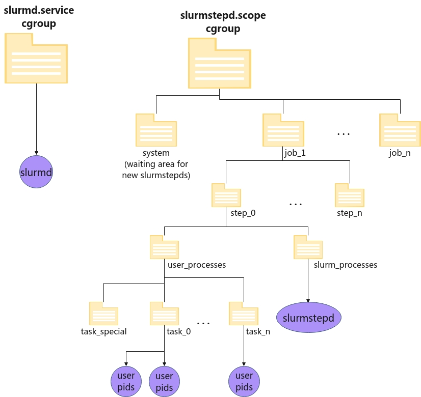

# Resource binding

CPU management steps:

- Select nodes
- Allocate CPU resources to jobs/step from the set of node selected in Step 1
- Distribute tasks to selected nodes
- Optional: distribute and bind tasks to CPUs

How cgroups plugin can be used in Slurm:

- proctrack/cgroup (for process tracking and management)
- task/cgroup (for constraining resources at step and task level)
- jobacct_gather/cgroup (for gathering statistics)

Slurm cgroup hierarchy:


Useful command:

- scontrol show job -d $SLURM_JOBID

# Cgroup v1 vs v2

- In v1, the resources contraints is implememeted by multiple cgroup or it can have multiple hierarchy while v2 only has one. Then, the resouces in v1 can be constrainted quite flexbible as each resources use a different hierarchy and process can belongs to multipleone. On the other hand, the resouces in v2 are constrainted top-down or the child process can only use the constrained resources that its parents has.
- Example code to set cpu constraints:
  - v1:
  ```bash
  mount -t tmpfs cgroup_root /sys/fs/cgroup
  mkdir /sys/fs/cgroup/cpuset
  mount -t cgroup cpuset -ocpuset /sys/fs/cgroup/cpuset
  cd /sys/fs/cgroup/cpuset
  mkdir Charlie
  cd Charlie
  /bin/echo 2-3 > cpuset.cpus
  /bin/echo 1 > cpuset.mems
  /bin/echo $$ > tasks
  ```
  - v2:
  ```bash

  ```

# Problems:

The number and layout of logical CPUs known to Slurm is described in the node definitions in slurm.conf. This may differ from the physical CPU layout on the actual hardware. For this reason, Slurm generates its own internal, or "abstract", CPU numbers. These numbers may not match the physical, or "machine", CPU numbers known to Linux.
